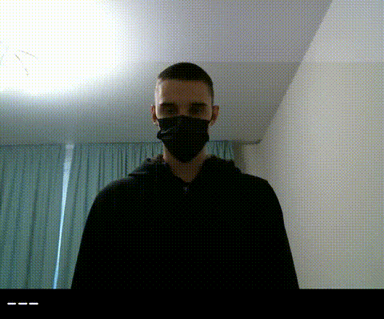

# Hakaton_1 Команда №5

Представляем Вашему вниманию работу по автосурдопереводчику основанному на предобученой модели Slovo.

Slovo — набор видеоданных русского языка жестов. Размер набора данных Slovo составляет около 16 ГБ и содержит 20400 RGB-видео для 1000 жестов языка жестов от 194 человек. В каждом классе по 20 образцов. Набор данных разделен на обучающий набор и тестовый набор. Обучающий набор включает 15300 видеороликов, тестовый набор — 5100 видеороликов. Общее время записи видео составляет ~9,2 часа. Около 35% видеороликов записаны в формате HD, а 65% видео — в разрешении FullHD. Средняя продолжительность видео с жестом — 50 кадров.
Для получения дополнительной информации см. https://github.com/hukenovs/slovo

Файл аннотаций прост в использовании и содержит несколько полезных столбцов, см. annotations.csvфайл:


где:\
attachment_id- имя видеофайла\
user_id- уникальный анонимизированный идентификатор пользователя\
width- ширина видео\
height- высота видео\
length- длина видео\
text-  значение жестов на русском языке\
train- входит ли файл в обучающую выборку\
begin- начало жеста (для исходного набора данных)\
end- конец жеста (для исходного набора данных)\
\
Для удобства подготовлена сжатая версия датасета, в которой все видео обрабатываются с минимальной стороны min_side = 360. Ссылка для скачивания — [slovo360p](https://n-ws-620xz-pd11.s3pd11.sbercloud.ru/b-ws-620xz-pd11-jux/slovo/slovo_full360.zip) .  Обрезанные видео аннотируются с помощью MediaPipe и указываем ключевые точки руки в этом файле аннотаций .

## Модели
В качестве предварительно обученной модели мы выбрали MViTv2-small-32-2

ONNX [weights](https://n-ws-620xz-pd11.s3pd11.sbercloud.ru/b-ws-620xz-pd11-jux/slovo/models/mvit/onnx/mvit32-2.onnx)\
TorchScript [weights](https://n-ws-620xz-pd11.s3pd11.sbercloud.ru/b-ws-620xz-pd11-jux/slovo/models/mvit/pt/mvit32-2.pt)

## Демо
```console
usage: demo.py [-h] -p CONFIG [--mp] [-v] [-l LENGTH]

optional arguments:
  -h, --help            show this help message and exit
  -p CONFIG, --config CONFIG
                        Path to config
  --mp                  Enable multiprocessing
  -v, --verbose         Enable logging
  -l LENGTH, --length LENGTH
                        Deque length for predictions


python demo.py -p <PATH_TO_CONFIG>
```



## Авторы
- Рушана: Тимлид
- Дмитрий: Клинический эксперт, консультант по работе поликлиники, бизнес-аналитик
- Виктория: Data инженер 
- Екатерина: Data инженер
- Денис: ML инженер
- Алексей: ML инженер 


## 

## Ссылки
- [arXiv](https://arxiv.org/abs/2305.14527)
- [Kaggle](https://www.kaggle.com/datasets/kapitanov/slovo)
- [Habr](https://habr.com/ru/companies/sberdevices/articles/737018/)
- [Medium](https://medium.com/@nagadit/slovo-russian-sign-language-dataset-a8a8bd6fa17d)
- [Github](https://github.com/hukenovs/slovo)
- [Gitlab](https://gitlab.aicloud.sbercloud.ru/rndcv/slovo)
- [Paperswithcode](https://paperswithcode.com/paper/slovo-russian-sign-language-dataset)

## Лицензии
<a rel="license" href="http://creativecommons.org/licenses/by-sa/4.0/"></a><br />This work is licensed under a variant of <a rel="license" href="http://creativecommons.org/licenses/by-sa/4.0/">Creative Commons Attribution-ShareAlike 4.0 International License</a>.

Please see the specific [license](https://github.com/hukenovs/slovo/blob/master/license/en_us.pdf).
